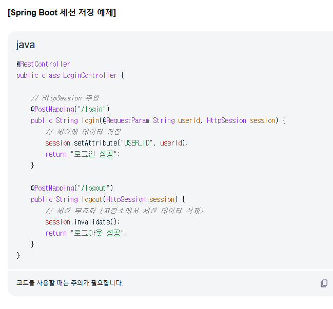
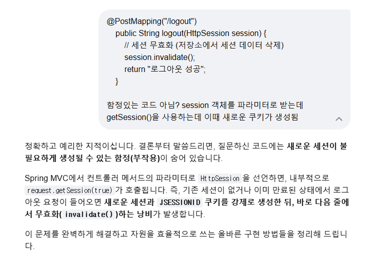

## 문제
- 증상: session.invalidate() 시 새로운 쿠키 생성되는 문제
- 상황:
```java
    @PostMapping("/logout")
    fun logout(session: HttpSession): ResponseEntity<Any> {
        session.invalidate()
        return ResponseEntity.status(HttpStatus.OK).body("OK")
    }
```

## 원인
session을 파라미터로 받는 부분에서 내부적으로 request.getSession(true)가 호출되어 불필요한 세션과 쿠키가 새로 생성됨

## 해결
```java
    @PostMapping("/logout")
    fun logout(request: HttpServletRequest, response: HttpServletResponse): ResponseEntity<Any> {
        val session = request.getSession(false)
        session.invalidate()
        val cookie = Cookie("JSESSIONID", null)
        cookie.maxAge = 0
        cookie.path = "/"
        response.addCookie(cookie)
        return ResponseEntity.status(HttpStatus.OK).body("OK")
    }
```

- HttpServletRequest에서 getSession(false)로 새로운 세션을 생성하여 가져오지 않는다.
- Cookie도 JSESSIONID에 value를 null, path도 "/"로 맞춰주어 추가하는 것으로 기존의 쿠키를 삭제한다.

## 배운 것
- HttpSession을 파라미터로 가져오면 새로운 세션을 생성한다.

## 추가
- 구글에 물어봐도 Gemini가 이렇게 답해준다.... 눈으로 보이는 것을 믿자


